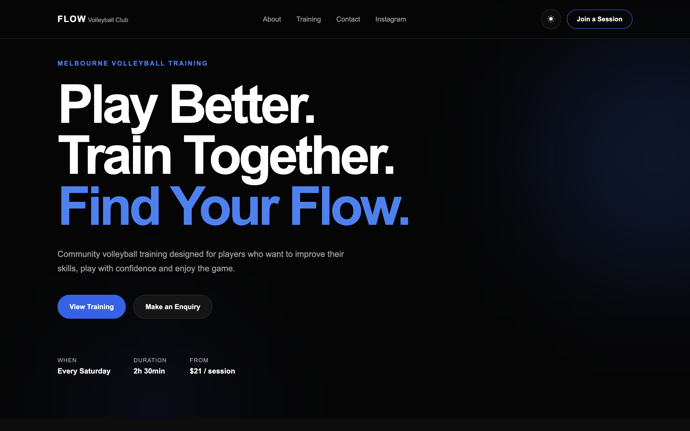

## Preview



# Flow Volleyball Club

A modern, responsive website built for Flow Volleyball Club, a Melbourne-based volleyball community offering structured weekly training sessions.

This project was designed and developed as a client-style business website, with a focus on clear information architecture, responsive design, accessibility, visual consistency and enquiry conversion.

## Live Website

[View the live website](https://flow-volleyball-club.vercel.app)

## Overview

The website provides visitors with a clear introduction to Flow Volleyball Club, weekly training information, venue details, social media links and a direct enquiry form.

The goal was to create a clean and modern sports-club website that works well across desktop, tablet and mobile devices while keeping the user journey simple:

**Learn about the club → View training details → Connect on Instagram → Send an enquiry**

## Features

* Responsive single-page business website
* Dark and light themes
* Persistent theme preference using local storage
* Weekly training schedule and pricing
* Training venue information
* Google Maps integration
* Instagram integration
* Client enquiry form
* Server-side enquiry email delivery
* Responsive navigation
* Accessible keyboard focus states
* Reduced-motion support
* SEO metadata
* Open Graph metadata
* Mobile, tablet and desktop layouts

## Training Information

* **Day:** Every Saturday
* **Duration:** 2 hours 30 minutes
* **Price:** $21 per person / session
* **Venue:** Orrong Romanis Recreation Centre
* **Location:** Prahran, Melbourne

## Tech Stack

* Next.js
* React
* TypeScript
* CSS
* Resend
* Vercel

## Project Structure

```text
app/
├── api/
│   └── enquiry/
│       └── route.ts
├── globals.css
├── icon.svg
├── layout.tsx
└── page.tsx

components/
├── About.tsx
├── Benefits.tsx
├── Contact.tsx
├── Footer.tsx
├── Hero.tsx
├── Instagram.tsx
├── Navbar.tsx
├── ThemeProvider.tsx
├── ThemeToggle.tsx
└── Training.tsx

lib/
└── siteConfig.ts

public/
└── flow-og.png
```

## Local Development

The following instructions are for anyone who wants to run the project locally from the GitHub repository.

### 1. Clone the repository

```bash
git clone https://github.com/Jaydenlaoyx/flow-volleyball-club.git
```

### 2. Navigate into the project

```bash
cd flow-volleyball-club
```

### 3. Install dependencies

```bash
npm install
```

### 4. Configure environment variables

Copy the example environment file:

```bash
cp .env.example .env.local
```

Then add the required values to `.env.local`:

```env
RESEND_API_KEY=
ENQUIRY_EMAIL=
```

### 5. Start the development server

```bash
npm run dev
```

Open:

```text
http://localhost:3000
```

## Environment Variables

| Variable         | Description                                   |
| ---------------- | --------------------------------------------- |
| `RESEND_API_KEY` | API key used by Resend to send enquiry emails |
| `ENQUIRY_EMAIL`  | Email address that receives website enquiries |

Production credentials and `.env.local` should never be committed to the repository.

## Validation

Run ESLint:

```bash
npm run lint
```

Create a production build:

```bash
npm run build
```

Both commands should pass before deployment.

## Design Approach

The website uses a minimal black, white and blue visual identity inspired by modern sports and fitness branding.

The interface prioritises:

* clear training information
* strong calls to action
* simple navigation
* mobile responsiveness
* accessible interactions
* visual consistency
* minimal clutter

Custom CSS was used rather than a UI component library to retain full control over layout, responsive behaviour, theming and visual styling.

## Technical Decisions

### Next.js App Router

The project uses the Next.js App Router for page rendering and API route handling.

### TypeScript

TypeScript is used across the project to provide stronger type safety and improve maintainability.

### Custom Theme System

Dark and light modes are implemented using React state, CSS custom properties and local storage to persist the visitor's preference.

### Server-Side Enquiry Handling

The contact form sends requests to a Next.js API route rather than exposing email credentials in the browser.

Resend handles email delivery from the server.

### Responsive Design

The interface includes dedicated desktop, tablet and mobile behaviour rather than relying on a single desktop layout scaled down for smaller screens.

### Accessibility

The site includes keyboard focus indicators and respects the user's `prefers-reduced-motion` operating-system preference.

## Future Improvements

Potential future additions include:

* online session booking
* player registration
* automated enquiry confirmation emails
* session capacity tracking
* training announcements
* CMS-managed content
* photo gallery
* match and event highlights

## Author

Designed and developed by **Jayden Lao** as a client-style software engineering portfolio project.
